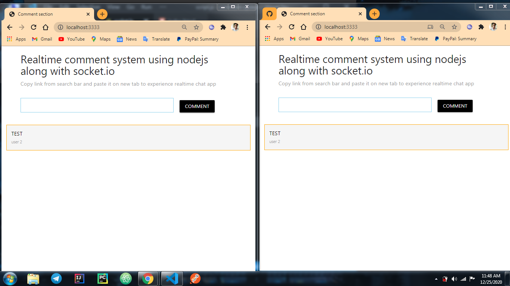

# comment-system
### This is a chat application.
### Built using 
1. HTML
2. CSS3 (Materialize CSS)
3. Vanilla Javascript
4. Nodejs + Socket.io library
##usage
Run the following cli command in console after cloning this repo.
```javascript
npm i
```
###Sample of the application

